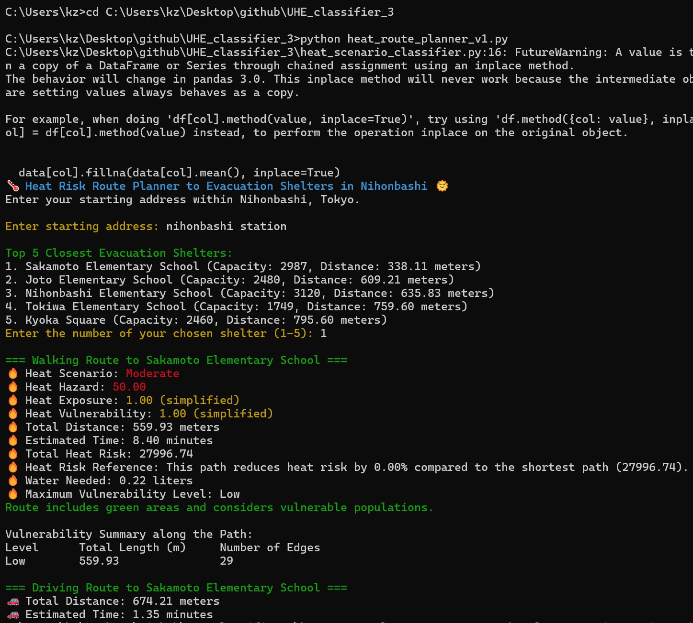
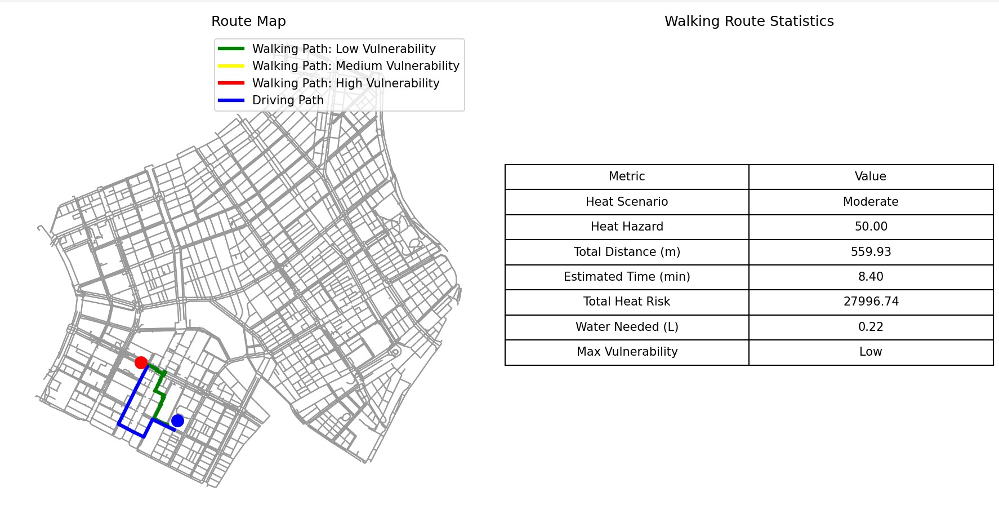

# UHE Classifier & Shelter Routing Platform

This project supports the **Urban Digital Twin for Nihonbashi** by evaluating and simulating urban network responses during extreme heat events. It includes real-time shelter routing, heat scenario classification, and predictive modeling.

---

## 🔧 Key Components

- **`heat_scenario_classifier.py`**  
  -  Reuses the preprocessing and classification logic from the previous code.
  -  Calculates the Heat Index and assigns scenarios ('Low', 'Moderate', 'High') based on thresholds.
  -  Trains a Random Forest Classifier and provides a function to predict scenarios for new inputs.

---


- **`heat_risk_predictor.py`**  
  - Imports the classification module to predict the UHE scenario.
  - The heat risk is now directly tied to the classification result: 80 for 'High', 50 for 'Moderate', and 20 for 'Low'.
  - Human comfort is calculated based on this heat risk, adjusted by wind speed and illumination.
  - Enhanced user interaction with colored prompts and a progress bar remains intact.

---

- **`heat_route_planner_v1.py`**
  
- Main route planner script for urban heat-aware evacuation.
- **User interaction:**
  - Enter a starting address in **Nihonbashi**.
  - Select one shelter from the **5 nearest options**.

  ### 🧭 Route Computation Steps:
  
  1. **Geocode** starting point using Google Maps API.
  2. **Fetch weather** conditions from OpenWeatherMap API.
  3. **Classify** current heat scenario: `Low`, `Moderate`, or `High`.
  4. **Generate 3 routes**:
     - 🥵 **Heat-optimized walking route** (minimizes risk using UHE + vulnerability)
     - 🚶 **Shortest walking route**
     - 🚗 **Driving route**
  5. **Calculate**:
     - Distance and estimated time
     - Total heat risk (accumulated exposure)
     - Water needed for safe walking
     - Segment vulnerability levels (Low/Med/High)
  

  
  ## 📊 Output
  
  - Detailed **terminal report** on risk, vulnerability, and distance.
  - A **Matplotlib plot** including:
    - **Color-coded walking route** (green/yellow/red for vulnerability)
    - **Driving route in blue**
    - **Start/end markers**
    - A **summary table** of route stats


## ✅Example Run Code and Output of `heat_route_planner_v1.py` in Terminal
1. Change directory to the script folder.
   ```bash
   cd path/to/UHE_classifier
   
2. Run the Python file:
   ```bash
   python heat_route_planner_v1.py
   
3. Enter a starting address in Nihonbashi.
4. Select a number between 1–5 for your chosen shelter.







---


- **`heat_route_planner_v2.py`**   – Backend Routing Engine for Flask App

This version of the heat-aware routing engine is built for **integration with a Flask server**. It does not run in the terminal, but instead exposes functionality that can be triggered from a **web app or dashboard** via API calls.


### 🔧 Purpose

- Serve as the **backend engine** that:
  - Accepts origin coordinates (latitude, longitude) from user input
  - Identifies the 5 nearest evacuation shelters
  - Predicts current **heat scenario** using real-time weather
  - Computes:
    - 🥵 Heat-optimized walking route
    - 🚶 Shortest walking route
    - 🚗 Driving route
  - Returns key stats: time, distance, risk, vulnerability
  - Generates route geometries for frontend map display


### 🧩 Typical Usage

This script is **imported and called inside `app.py`**, the Flask server. It enables:

- API endpoint like `/get_route?origin=...&destination=...`
- Output in JSON or GeoJSON format
- Route stats used for user-side dashboards

### 🗂️ Input & Output

- **Input:** Address name from user-selected origin and shelter number
- **Output:** 
  - GeoJSON of route segments (walking + driving)
  - Summary stats: time, distance, heat risk, water needed
  - Vulnerability labels for each segment
 

## 🌐 Run Code and Output of `app.py` in Terminal
1. Change directory to the script folder.
   ```bash
   cd path/to/UHE_classifier

2. Run the server:

    ```bash
    python app.py

3. Once started, the Flask app will be running at:
http://127.0.0.1:8083/get-test

## Example API Calls
  🏠 Query Nearby Shelters
  Get the 5 closest shelters to a location (e.g., Nihonbashi Station):

  - http://127.0.0.1:8083/query-shelters?address=nihonbashi%20station
  - 📤 Output: JSON response with shelter names, capacities, and distances.

🧭 Query Optimized Route to Selected Shelter
  Compute routes from the given address to one of the suggested shelters:

  - http://127.0.0.1:8083/query-routes?address=nihonbashi%20station&shelter_id=1
  - 📤 Output: GeoJSON with:
    - Heat-optimized walking path
    - Driving route
    - Route segment stats (heat risk, distance, vulnerability)


